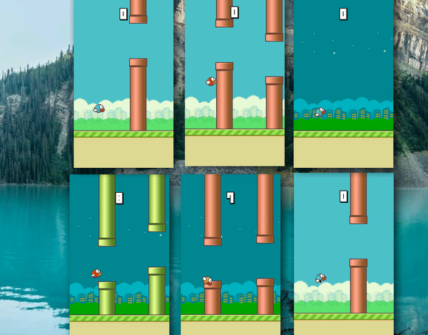

# FlapPyBird with Parallel Q-Learning

The goal of this project is to parallel train a Reinforement Learning algorithm to play flappy bird. This will be done through techniques discussed in this [whitepaper](https://arxiv.org/pdf/1507.04296.pdf).

## What works
- Q learning bot can sucessfully train on the flappy bird env
- Modified game structure to allow multiple games to run simltaneously
- Parallel Combining of Q-Table 
- Build Q-Table 'server' that takes in q tables from worker processes and determines the best combinations after every few iterations

## Still In Progress

- [ ] Better Handling of saving q table to file
- [ ] Convert global variables into flags(ie: no iterations, no of instances, no gui)
- [ ] Optimize code for faster iterations
- [ ] Finish documentation
- [ ] Clean up folder structure
- [ ] Remove unused assets (ie. Audio files)

## Training

**6 Agents**

## Usage

`python flappy.py`

## Credits
Q-learning Tutorial:
[https://towardsdatascience.com/simple-reinforcement-learning-q-learning-fcddc4b6fe56](https://towardsdatascience.com/simple-reinforcement-learning-q-learning-fcddc4b6fe56)

The flappy bird game portion of this project was obtained from:
[https://github.com/sourabhv/FlapPyBird](https://github.com/sourabhv/FlapPyBird)
